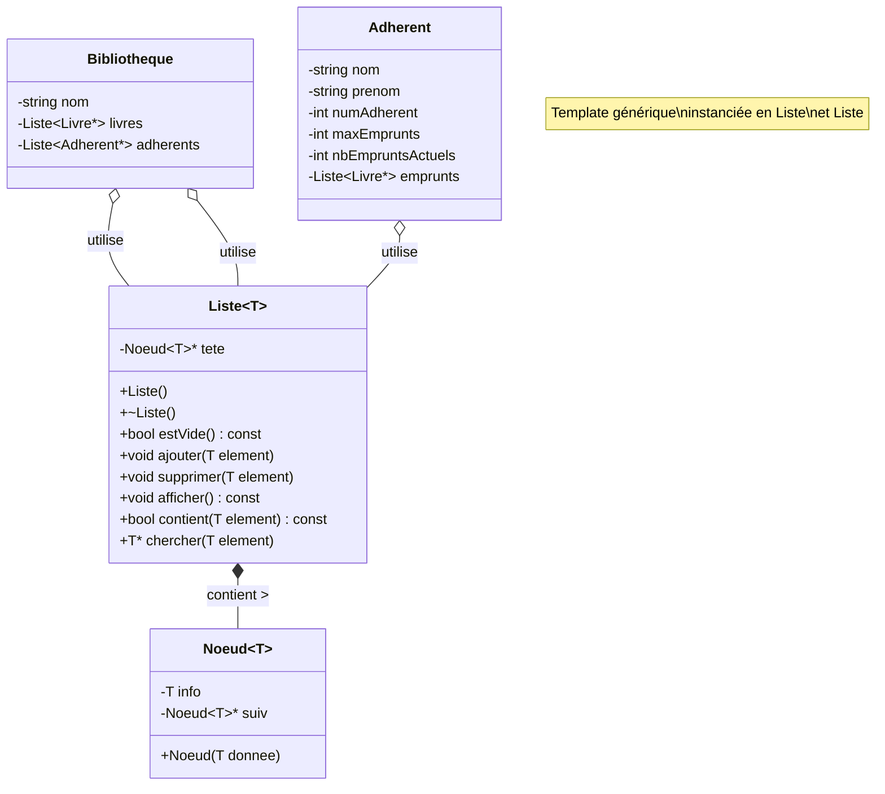

```mermaid

classDiagram

    %% --- TEMPLATE CLASSES ---
    class Noeud~T~ {
        -T info
        -Noeud~T~* suiv
        +Noeud(T donnee)
    }

    class Liste~T~ {
        -Noeud~T~* tete
        +Liste()
        +~Liste()
        +bool estVide() const
        +void ajouter(T element)
        +void supprimer(T element)
        +void afficher() const
        +bool contient(T element) const
        +T* chercher(T element)
    }

    Liste *-- Noeud : contient >

    %% --- CLASSES UTILISANT LA LISTE ---
    class Bibliotheque {
        -string nom
        -Liste~Livre*~ livres
        -Liste~Adherent*~ adherents
    }

    class Adherent {
        -string nom
        -string prenom
        -int numAdherent
        -int maxEmprunts
        -int nbEmpruntsActuels
        -Liste~Livre*~ emprunts
    }

    Bibliotheque o-- Liste~Livre*~ : utilise
    Bibliotheque o-- Liste~Adherent*~ : utilise
    Adherent o-- Liste~Livre*~ : utilise

    %% --- LÉGENDE ---
    note for Liste~T~ "Template générique\ninstanciée en Liste<Livre*>\net Liste<Adherent*>"

```