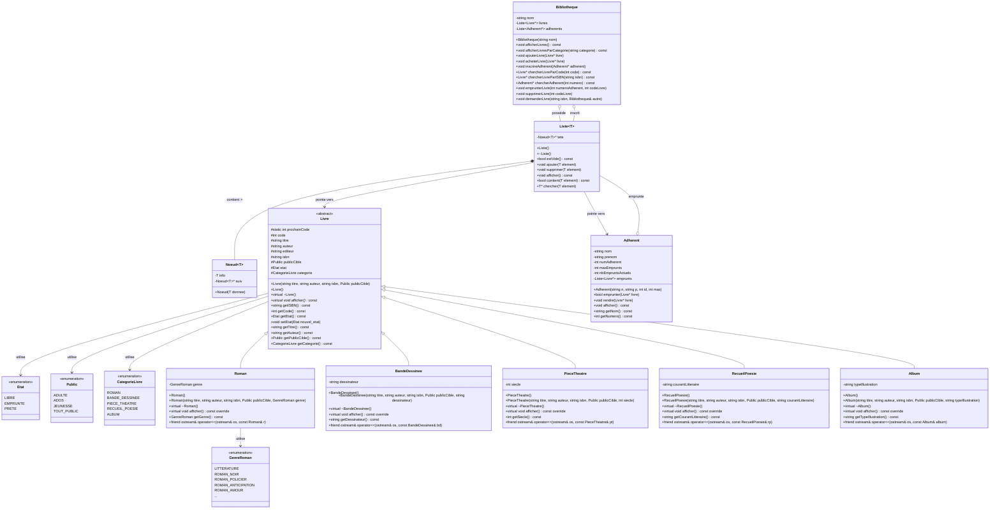

```mermaid

classDiagram

    %% --- ENUMS ---
    class Etat {
        <<enumeration>>
        LIBRE
        EMPRUNTE
        PRETE
    }

    class Public {
        <<enumeration>>
        ADULTE
        ADOS
        JEUNESSE
        TOUT_PUBLIC
    }

    class CategorieLivre {
        <<enumeration>>
        ROMAN
        BANDE_DESSINEE
        PIECE_THEATRE
        RECUEIL_POESIE
        ALBUM
    }

    class GenreRoman {
        <<enumeration>>
        LITTERATURE
        ROMAN_NOIR
        ROMAN_POLICIER
        ROMAN_ANTICIPATION
        ROMAN_AMOUR
        ...
    }

    %% --- TEMPLATE CLASSES ---
    class Noeud~T~ {
        -T info
        -Noeud~T~* suiv
        +Noeud(T donnee)
    }

    class Liste~T~ {
        -Noeud~T~* tete
        +Liste()
        +~Liste()
        +bool estVide() const
        +void ajouter(T element)
        +void supprimer(T element)
        +void afficher() const
        +bool contient(T element) const
        +T* chercher(T element)
    }

    Liste *-- Noeud : contient >

    %% --- CLASSE ABSTRAITE LIVRE ---
    class Livre {
        <<abstract>>
        #static int prochainCode
        #int code
        #string titre
        #string auteur
        #string editeur
        #string isbn
        #Public publicCible
        #Etat etat
        #CategorieLivre categorie
        +Livre(string titre, string auteur, string isbn, Public publicCible)
        +Livre()
        +virtual ~Livre()
        +virtual void afficher()* const
        +string getISBN() const
        +int getCode() const
        +Etat getEtat() const
        +void setEtat(Etat nouvel_etat)
        +string getTitre() const
        +string getAuteur() const
        +Public getPublicCible() const
        +CategorieLivre getCategorie() const
    }

    Livre --> Etat : utilise
    Livre --> Public : utilise
    Livre --> CategorieLivre : utilise

    %% --- CLASSES DÉRIVÉES ---
    class Roman {
        -GenreRoman genre
        +Roman()
        +Roman(string titre, string auteur, string isbn, Public publicCible, GenreRoman genre)
        +virtual ~Roman()
        +virtual void afficher() const override
        +GenreRoman getGenre() const
        +friend ostream& operator<<(ostream& os, const Roman& r)
    }

    class BandeDessinee {
        -string dessinateur
        +BandeDessinee()
        +BandeDessinee(string titre, string auteur, string isbn, Public publicCible, string dessinateur)
        +virtual ~BandeDessinee()
        +virtual void afficher() const override
        +string getDessinateur() const
        +friend ostream& operator<<(ostream& os, const BandeDessinee& bd)
    }

    class PieceTheatre {
        -int siecle
        +PieceTheatre()
        +PieceTheatre(string titre, string auteur, string isbn, Public publicCible, int siecle)
        +virtual ~PieceTheatre()
        +virtual void afficher() const override
        +int getSiecle() const
        +friend ostream& operator<<(ostream& os, const PieceTheatre& pt)
    }

    class RecueilPoesie {
        -string courantLitteraire
        +RecueilPoesie()
        +RecueilPoesie(string titre, string auteur, string isbn, Public publicCible, string courantLitteraire)
        +virtual ~RecueilPoesie()
        +virtual void afficher() const override
        +string getCourantLitteraire() const
        +friend ostream& operator<<(ostream& os, const RecueilPoesie& rp)
    }

    class Album {
        -string typeIllustration
        +Album()
        +Album(string titre, string auteur, string isbn, Public publicCible, string typeIllustration)
        +virtual ~Album()
        +virtual void afficher() const override
        +string getTypeIllustration() const
        +friend ostream& operator<<(ostream& os, const Album& album)
    }

    Livre <|-- Roman
    Livre <|-- BandeDessinee
    Livre <|-- PieceTheatre
    Livre <|-- RecueilPoesie
    Livre <|-- Album
    Roman --> GenreRoman : utilise

    %% --- CLASSE ADHERENT ---
    class Adherent {
        -string nom
        -string prenom
        -int numAdherent
        -int maxEmprunts
        -int nbEmpruntsActuels
        -Liste~Livre*~ emprunts
        +Adherent(string n, string p, int id, int max)
        +bool emprunter(Livre* livre)
        +void rendre(Livre* livre)
        +void afficher() const
        +string getNom() const
        +int getNumero() const
    }

    %% --- CLASSE BIBLIOTHEQUE ---
    class Bibliotheque {
        -string nom
        -Liste~Livre*~ livres
        -Liste~Adherent*~ adherents
        +Bibliotheque(string nom)
        +void afficherLivres() const
        +void afficherLivresParCategorie(string categorie) const
        +void ajouterLivre(Livre* livre)
        +void acheterLivre(Livre* livre)
        +void inscrireAdherent(Adherent* adherent)
        +Livre* chercherLivreParCode(int code) const
        +Livre* chercherLivreParISBN(string isbn) const
        +Adherent* chercherAdherent(int numero) const
        +void emprunterLivre(int numeroAdherent, int codeLivre)
        +void supprimerLivre(int codeLivre)
        +void demanderLivre(string isbn, Bibliotheque& autre)
    }

    %% --- RELATIONS ---
    Bibliotheque o-- Liste~Livre*~ : possède
    Bibliotheque o-- Liste~Adherent*~ : inscrit
    Adherent o-- Liste~Livre*~ : emprunte
    Liste~Livre*~ --> Livre : pointe vers
    Liste~Adherent*~ --> Adherent : pointe vers

```