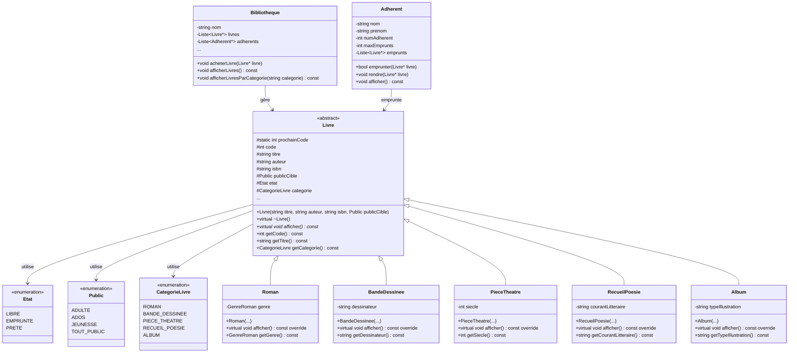

```mermaid
classDiagram

    %% --- ENUMS ---
    class Etat {
        <<enumeration>>
        LIBRE
        EMPRUNTE
        PRETE
    }

    class Public {
        <<enumeration>>
        ADULTE
        ADOS
        JEUNESSE
        TOUT_PUBLIC
    }

    class CategorieLivre {
        <<enumeration>>
        ROMAN
        BANDE_DESSINEE
        PIECE_THEATRE
        RECUEIL_POESIE
        ALBUM
    }

    %% --- CLASSE ABSTRAITE ---
    class Livre {
        <<abstract>>
        #static int prochainCode
        #int code
        #string titre
        #string auteur
        #string isbn
        #Public publicCible
        #Etat etat
        #CategorieLivre categorie
        +Livre(string titre, string auteur, string isbn, Public publicCible)
        +virtual ~Livre()
        +virtual void afficher()* const
        +int getCode() const
        +string getTitre() const
        +CategorieLivre getCategorie() const
        ...
    }

    Livre --> Etat : utilise
    Livre --> Public : utilise
    Livre --> CategorieLivre : utilise

    %% --- CLASSES DÉRIVÉES ---
    class Roman {
        -GenreRoman genre
        +Roman(...)
        +virtual void afficher() const override
        +GenreRoman getGenre() const
    }

    class BandeDessinee {
        -string dessinateur
        +BandeDessinee(...)
        +virtual void afficher() const override
        +string getDessinateur() const
    }

    class PieceTheatre {
        -int siecle
        +PieceTheatre(...)
        +virtual void afficher() const override
        +int getSiecle() const
    }

    class RecueilPoesie {
        -string courantLitteraire
        +RecueilPoesie(...)
        +virtual void afficher() const override
        +string getCourantLitteraire() const
    }

    class Album {
        -string typeIllustration
        +Album(...)
        +virtual void afficher() const override
        +string getTypeIllustration() const
    }

    %% --- HÉRITAGE ---
    Livre <|-- Roman
    Livre <|-- BandeDessinee
    Livre <|-- PieceTheatre
    Livre <|-- RecueilPoesie
    Livre <|-- Album

    %% --- CLASSES UTILISATEURS ---
    class Adherent {
        -string nom
        -string prenom
        -int numAdherent
        -int maxEmprunts
        -Liste~Livre*~ emprunts
        +bool emprunter(Livre* livre)
        +void rendre(Livre* livre)
        +void afficher() const
    }

    class Bibliotheque {
        -string nom
        -Liste~Livre*~ livres
        -Liste~Adherent*~ adherents
        +void acheterLivre(Livre* livre)
        +void afficherLivres() const
        +void afficherLivresParCategorie(string categorie) const
        ...
    }

    %% --- RELATIONS ---
    Bibliotheque --> Livre : gère
    Adherent --> Livre : emprunte

```
