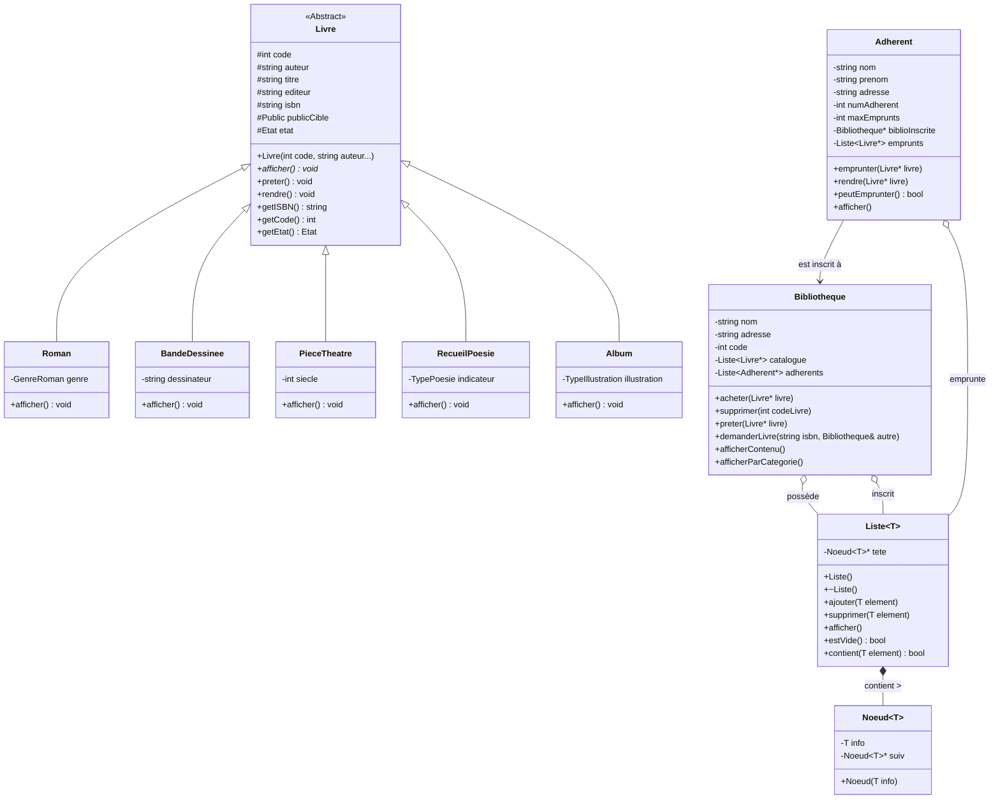

```mermaid

classDiagram

    class Noeud~T~ {
        -T info
        -Noeud~T~* suiv
        +Noeud(T info)
    }

    class Liste~T~ {
        -Noeud~T~* tete
        +Liste()
        +~Liste()
        +ajouter(T element)
        +supprimer(T element)
        +afficher()
        +estVide() bool
        +contient(T element) bool
    }

    Liste *-- Noeud : contient >

    class Livre {
        <<Abstract>>
        #int code
        #string auteur
        #string titre
        #string editeur
        #string isbn
        #Public publicCible
        #Etat etat
        +Livre(int code, string auteur...)
        +afficher()* void
        +preter() void
        +rendre() void
        +getISBN() string
        +getCode() int
        +getEtat() Etat
    }

    %% --- CLASSES FILLES (HÉRITAGE) ---
    class Roman {
        -GenreRoman genre
        +afficher() void
    }

    class BandeDessinee {
        -string dessinateur
        +afficher() void
    }

    class PieceTheatre {
        -int siecle
        +afficher() void
    }

    class RecueilPoesie {
        -TypePoesie indicateur
        +afficher() void
    }

    class Album {
        -TypeIllustration illustration
        +afficher() void
    }

    Livre <|-- Roman
    Livre <|-- BandeDessinee
    Livre <|-- PieceTheatre
    Livre <|-- RecueilPoesie
    Livre <|-- Album

    class Adherent {
        -string nom
        -string prenom
        -string adresse
        -int numAdherent
        -int maxEmprunts
        -Bibliotheque* biblioInscrite
        -Liste~Livre*~ emprunts
        +emprunter(Livre* livre)
        +rendre(Livre* livre)
        +peutEmprunter() bool
        +afficher()
    }

    class Bibliotheque {
        -string nom
        -string adresse
        -int code
        -Liste~Livre*~ catalogue
        -Liste~Adherent*~ adherents
        +acheter(Livre* livre)
        +supprimer(int codeLivre)
        +preter(Livre* livre)
        +demanderLivre(string isbn, Bibliotheque& autre)
        +afficherContenu()
        +afficherParCategorie()
    }

    Bibliotheque o-- Liste~Livre*~ : possède
    Bibliotheque o-- Liste~Adherent*~ : inscrit

    Adherent o-- Liste~Livre*~ : emprunte

    Adherent --> Bibliotheque : est inscrit à

```